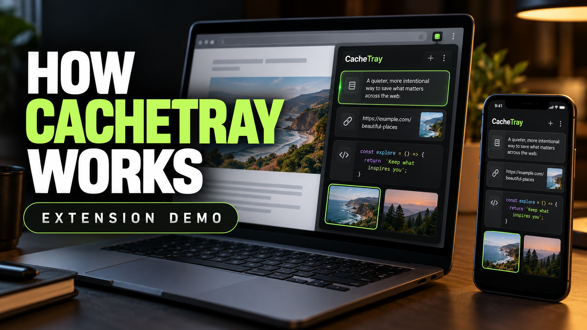
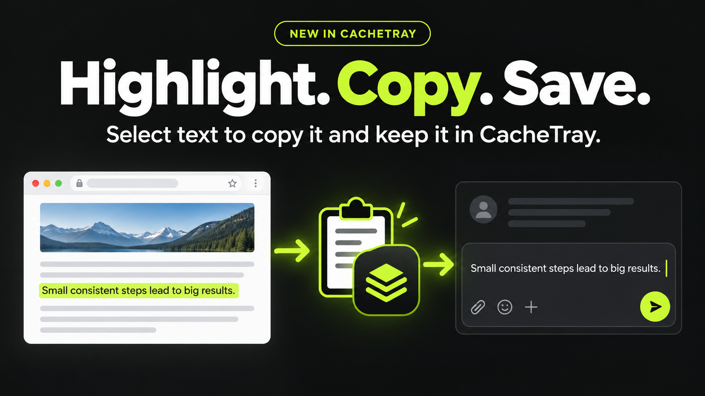
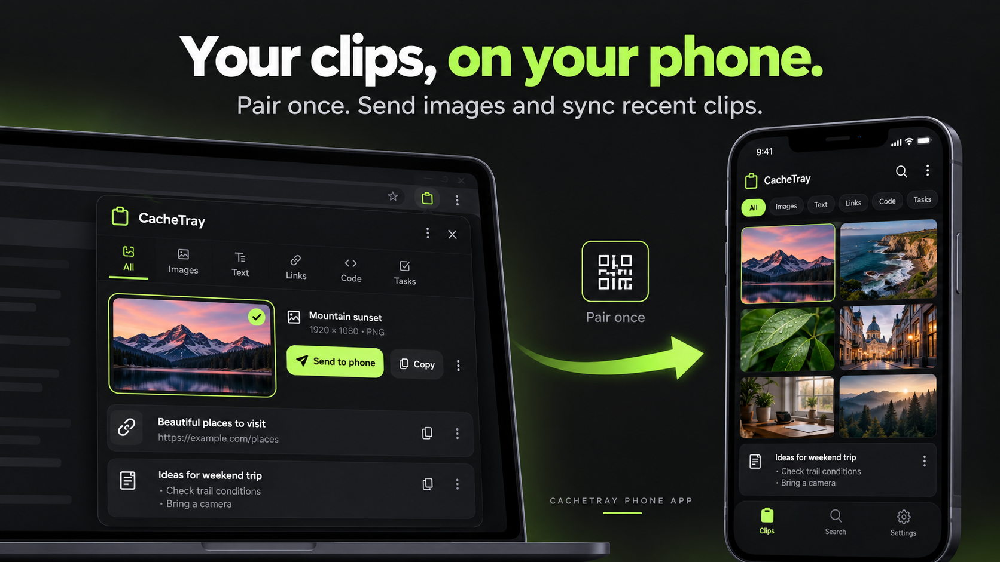
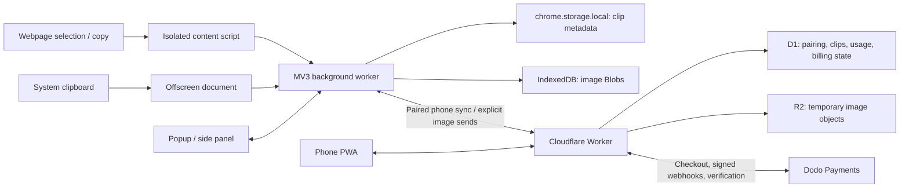

<p align="center">
  
</p>

<h1 align="center">CacheTray</h1>

<p align="center">
  Your clipboard remembers one thing. CacheTray keeps the context you need next.
</p>

<p align="center">
  <a href="https://chromewebstore.google.com/detail/pgohpbolcaaoenhaapkikmheckannlpn">Install for Chrome</a>
  · <a href="https://cachetray.gitflex.lol">Website</a>
  · <a href="https://cachetray.gitflex.lol/received.html">Phone app</a>
  · <a href="#development">Run locally</a>
</p>

CacheTray is a local-first clipboard manager for research, coding and AI workflows. Collect screenshots, links, code and text in one tray, pick the context that matters, and send it to ChatGPT or Claude without repeatedly downloading files and copying things back and forth.

Built as a **Chrome Manifest V3 extension**, with a **phone PWA**, **Cloudflare backend** and **Dodo Payments subscriptions**. Current extension version: **1.7.8**.

## Watch it work

[](CacheTray-Demo-v2.mp4)

**[Watch the demo](CacheTray-Demo-v2.mp4)** · **[Watch with narration](CacheTray-Demo-Voiceover.mp4)**

Click the thumbnail to open the video file on GitHub. If playback is unavailable, download the MP4 to watch it locally.

<details>
<summary>More demo material</summary>

[Original demo recording](CacheTray-Demo.mp4)

</details>

## Two small changes that save a lot of repetition

### Highlight. Copy. Save.

Select text on a supported webpage. CacheTray copies it to your system clipboard **and** saves it in your tray, so you can paste it immediately or find it again later. Available on Free and Pro.



Selection capture replaces your current clipboard. Pause auto-capture to turn it off; password and editable fields are excluded from selection capture.

### Your clips, on your phone.

Install the phone web app, pair with a QR code, and keep recent text, links, code and tasks within reach. Send images individually when you want them on your phone, then preview, download or share them through your phone's share sheet.



*The images above are promotional feature illustrations. The demo recordings show the working extension.*

## What you can do

| Workflow | What CacheTray gives you |
| --- | --- |
| Capture useful context | Save copied text, links, code and images; highlight text to copy and save; add notes, tasks or the current tab. |
| Find it again | Category filters, search, workspaces and favourites keep related context together. |
| Give AI the right context | Select mixed items and send them to ChatGPT or Claude. Copy or insert saved text into other supported inputs. |
| Stay in your flow | Use the quick popup, persistent Chrome side panel or keyboard shortcuts. |
| Move from desktop to phone | QR pairing without an account, recent clip sync and individual image transfers. |
| Use a proper phone inbox | Image thumbnails, grid/list views, clip categories, link actions, sharing, download feedback and swipe-to-delete in image list view. |

### Try it in a minute

1. [Install CacheTray](https://chromewebstore.google.com/detail/pgohpbolcaaoenhaapkikmheckannlpn) and open the popup or side panel.
2. Highlight a useful sentence, copy a link or capture an image.
3. Find it in the tray, select the items you need, and send them into your AI chat.
4. For mobile, open the phone setup in the extension, scan the install QR, install the web app, then use the pairing QR to connect.

On **Android**, install from Chrome. On **iPhone**, use Safari → Share → Add to Home Screen. Installation guidance adapts to the phone.

## How it is built

The local tray works independently of the phone backend. Cloud services enter the workflow when a user pairs a phone or purchases Pro.



| Layer | Technology | Responsibility |
| --- | --- | --- |
| Extension | JavaScript, HTML/CSS, Chrome Manifest V3 | Capture, clipboard access, popup, side panel and user-triggered insertion. |
| Local persistence | Chrome storage + IndexedDB | Keep clip metadata separate from image bytes. |
| Phone app | Installable PWA, service worker, native Web Share API | Browse received clips and images without a native app download. |
| Transfer API | Cloudflare Workers, D1, R2, `aws4fetch` | Pairing, temporary sync, signed image transfers and quota enforcement. |
| Billing | Dodo Payments | Hosted checkout and server-verified subscription entitlements. |
| Website | Static HTML/CSS/JavaScript on Cloudflare Pages | Product pages, installation guidance, phone inbox, privacy and support. |
| Verification | Node test runner + Playwright | Storage, capture, quota, billing and browser regressions. |

### Engineering decisions worth looking at

- **One writer for collection changes.** Popup, side panel and capture events submit patches to a serialized background save queue. Stable IDs and patch-based updates prevent stale UI snapshots from overwriting newly captured items. See [collection-store.js](collection-store.js) and [background.js](background.js).
- **A saved image means a committed image.** Image writes are acknowledged after the IndexedDB transaction completes. Retry reads and reference-aware cleanup help avoid metadata pointing to missing image bytes. See [shared.js](shared.js).
- **Capture has a trust boundary.** Capture runs in an isolated content script, checks trusted user gestures and excludes editable selection targets. A webpage cannot grant itself capture authority through a forged window message. See [content-script.js](content-script.js) and [capture security tests](tests/capture-security.test.js).
- **Limits belong on the server.** Image transfers reserve quota before upload and validate uploaded object size/type before becoming ready. Billing checks webhook signatures and verifies subscription state with the payment provider; a frontend Pro badge does not grant access. See [plans.js](transfer-worker/src/plans.js) and [billing.js](transfer-worker/src/billing.js).

## Local-first, with temporary phone sync

- The extension's saved tray stays on the device by default. Local use does not require an account or payment.
- Pairing enables temporary cloud sync for recent text, links, code and tasks. Images upload only when you send them to a phone.
- Local clips currently expire after **3 days**, including favourites. Phone clips and sent images are available for **24 hours** on both plans.
- Phone image deletion removes the corresponding cloud transfer/object, not the local extension original. Downloads and copies shared to other apps are separate files.
- Cloud image expiry is backed by cleanup and an R2 lifecycle rule. Physical lifecycle deletion is asynchronous, not guaranteed at the exact 24-hour mark.
- Phone transfers are **not end-to-end encrypted**. Pairing credentials and Pro recovery keys should be treated as private.

[Read the privacy policy](https://cachetray.gitflex.lol/privacy.html).

### Free and Pro

The local tray and selection-to-copy feature are available to everyone. Pro increases phone limits.

| Phone feature | Free | Pro — $4.99 USD/month, plus applicable taxes |
| --- | --- | --- |
| Images | 5 successful sends per rolling 24 hours | 50 stored images per phone |
| Recent text, links, code and tasks | Newest 20 items in each category | Newest 100 items in each category |
| Paired phones per extension | 1 | 2 |
| Phone content availability | 24 hours | 24 hours |

Deleting an image **does not reset** Free's daily send allowance. Pro image slots become available after deletion or expiry. Free usage is tied to an anonymous installation identity; it is not an account-backed, abuse-proof identity system.

## Development

### Load the extension

```sh
git clone https://github.com/wenayy/cachetray_v4.git
cd cachetray_v4
```

1. Open `chrome://extensions` and enable **Developer mode**.
2. Choose **Load unpacked** and select this repository's root directory, containing `manifest.json`.
3. Pin CacheTray and open it. There is no extension build step.

The repository includes production transfer URLs. Local tray development does not need a backend; for your own phone/billing deployment, configure your own endpoints and Cloudflare resources instead of using the production service.

### Run the phone website locally

```sh
python3 -m http.server 8080 --directory cachetraywebsite
```

Open `http://localhost:8080/received.html`. Phone camera access, installation and sharing depend on browser support and a secure context; use HTTPS when testing on an actual phone.

### Run your own transfer backend

Use **Node.js 22 or newer** for the Worker tooling and test suite.

```sh
cd transfer-worker
npm ci
```

Before running it, configure [wrangler.jsonc](transfer-worker/wrangler.jsonc) for your own D1 database, R2 bucket, web origin and extension origin. Then:

```sh
npm run db:local
npm run dev
```

Point [transfer-config.js](transfer-config.js) and [the phone configuration](cachetraywebsite/transfer-config.js) at your development API. Hosted phone transfers also need the correct R2 CORS origins and lifecycle rule.

**Keep credentials server-side.** `DODO_API_KEY`, `DODO_WEBHOOK_SECRET`, `R2_ACCESS_KEY_ID` and `R2_SECRET_ACCESS_KEY` belong in Worker secrets—not extension files, the public website, GitHub or a release ZIP. Use Dodo test mode and a sandbox product while developing billing.

### Run the regression tests

After installing the Worker dependencies, run from the repository root:

```sh
node --test transfer-worker/test/*.test.js tests/*.test.js
```

The suite covers collection patches, concurrent updates, capture security, selection behavior, image persistence, plan limits and billing verification.

[Browser release checks](tests/browser-release.cjs) additionally exercise popup/sidebar concurrency, image capture and undo, safe rendering, selection capture and forged-message rejection in an isolated extension profile. Set `PLAYWRIGHT_MODULE` to your installed Playwright module path and install its Chromium browser before running that script. Clipboard transport is stubbed in the harness, so it does not replace manual testing of the real system clipboard.

### Package a release

After updating the version in `manifest.json`:

```sh
node scripts/package-extension.cjs
```

The packager uses an explicit runtime-file allowlist, checks for credential patterns, validates referenced HTML resources and tests the ZIP. It refuses to overwrite an existing versioned archive. Backend files, tests and demo media are not included in the extension upload.

## Repository guide

```text
.
├── manifest.json                 Chrome extension entry points and permissions
├── background.js                 Capture orchestration and serialized saves
├── collection-store.js           Shared collection patch logic
├── shared.js                     Data helpers and IndexedDB image storage
├── content-script.js             Trusted webpage copy and selection capture
├── offscreen.js                  Clipboard access outside the service worker
├── popup.* / sidebar.*           Extension interfaces
├── transfer-*.js / billing-ui.js Phone pairing, transfers and billing UI
├── cachetraywebsite/             Website and production phone PWA
├── transfer-worker/
│   ├── src/                      Cloudflare API, quotas and billing
│   ├── migrations/               D1 schema migrations
│   └── test/                     Backend regression tests
├── tests/                        Extension storage, capture and browser tests
├── scripts/                      Release packaging and website preparation
└── mobile/                       Earlier native-client experiment, not the production PWA
```

## Current boundaries

Chrome's restricted pages do not allow normal content-script capture. AI insertion depends on the destination site's editor and may need updating when that site changes. The phone PWA is an inbox for desktop-to-phone transfers, not a system-wide mobile clipboard listener or a guaranteed background-delivery service. Existing server checks reduce specific abuse paths; they are not a claim that the system is impossible to abuse.

## Support

[Support page](https://cachetray.gitflex.lol/support.html) · [Email treastingmike@gmail.com](mailto:treastingmike@gmail.com) · [Privacy policy](https://cachetray.gitflex.lol/privacy.html)
